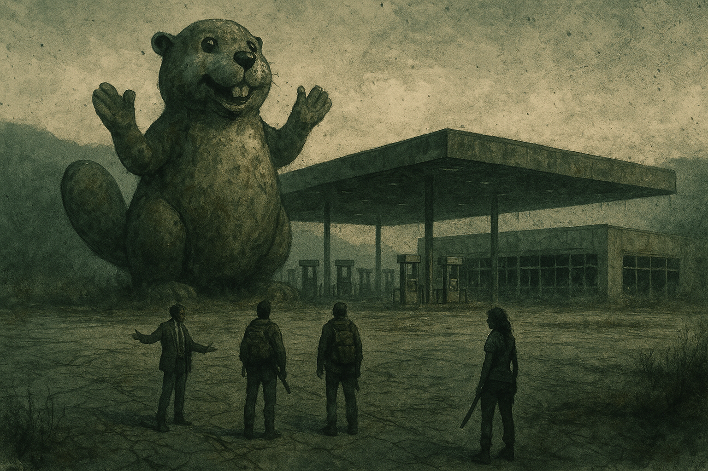

# Nine in the Hollow

*Session zero · 2026-08-30*

## Overview

Before a single die was rolled in anger, the table decided what everyone in these
mountains believes: that the herds here **climb**, that a walker was once seen to
**pause before attacking a child**, that the landmark you navigate by is a haunted
school bus called **the Old Yeller**, and that a man calling himself **the
Watchman** is still broadcasting conspiracies from somewhere out past the dial.
Four survivors were built, four Anchors were chosen, and out of three possible
homes the group took the cabin at the end of the washed-out logging road.

Nine people now live in a hunting cabin rated for far fewer.

## Key Events

### The Unsetting Questions

Each player rolled once, and the answers became canon:

- **The herd here climbs.** People have seen them in trees, coming up the sides
  of the mountains the way bears do — over the hillside before you know they're
  there. This single answer quietly undid the group's entire reason for choosing
  high ground.
- **One paused before attacking a child.** No explanation offered. Nobody liked
  it. It stayed.
- **The Old Yeller.** A school bus whose driver had a heart attack behind the
  wheel and turned with a full load of kids aboard. Some say it's haunted. The
  name was arrived at by way of a groan-worthy pun that the table immediately
  and unanimously adopted. See [the Old Yeller](../wiki/locations/the-old-yeller.md).
- **The Watchman.** A conspiracy broadcaster named after the graphic novel he took
  too seriously — chemicals in the water, fluoride, all of it. The group
  specifically ruled that the broadcasts are *not* a loop: they change each time,
  so he's still alive. And one day he might go quiet. See
  [the Watchman](../wiki/npcs/the-watchman.md).

### Choosing a Home

Three havens were on the table: [the Last Stop](../wiki/locations/the-last-stop.md)
(an unfinished Buc-ee's), **the Ark** (a grounded houseboat in a cove), and
**the Hollow** (a hunting cabin up a logging road).

The Buc-ee's was the one everybody *wanted*. It was also the one that would kill
them — fifty pumps, a fifteen-foot fiberglass mascot visible for miles, more doors
than anyone can watch, and a full propane cage out back. The group talked itself
out of it inside a minute and then spent the rest of the session mourning it.

They took **[the Hollow](../wiki/locations/the-hollow.md)**, and placed it in a
sector near **Soddy-Daisy** — river access, natural resources, not quite on top of
Chattanooga.

Then came the twist that reframed the whole group: the Hollow is **Johnathan
Banks' family cabin**, his father's or grandfather's. He was a rich, snarky punk
with a place he barely used, and everyone else there is a straggler he took in
against his better judgment.

### Four Survivors

- **Johnathan Banks** — Broker. Wall Street; ran insider trades for mobsters and
  hopes they're all dead. Carries no weapon, two sets of scales, and letters of
  introduction to three other havens. Drive: *"I just gotta ring the bell."*
- **Ashley "Ash" Fairfax** — Nobody. College dropout and burnout who was
  delivering a pizza when the world ended, got caught in a herd, and ran into the
  woods. Issue: doesn't care if she lives. Drive: *"Keeps going anyway."*
- **Dr. Charles "Chuck" Greenbriar** — Scientist. A biologist who really wanted to
  be a cryptozoologist and now believes the walkers prove he was right all along.
  Drive: *"I'm not crazy."*
- **Clara "CJ" James** — Homemaker. A pilates-and-martial-arts soccer mom with no
  family left and a number she's trying to run up. Agility 5, the highest stat at
  the table. Issue: Bloodthirsty.

### Anchors

Five people were already living at the Hollow, and the survivors chose who they'd
hold onto:

- Banks took **[Sister Ruth Okafor](../wiki/npcs/ruth-okafor.md)** — and the story
  behind it is the ugliest thing established all session. He met her at the
  retirement home, one of the havens he holds a letter for, and talked her into
  abandoning her patients: *"Just read these people their last rites and then come
  help us."*
- Chuck took **[Dale Pruitt](../wiki/npcs/dale-pruitt.md)**, the moonshiner who
  sheltered him before all this — *"Dale sees things when he's at the bottom of a
  bottle. He feeds my delusions."*
- CJ took **[Birdie Coyle](../wiki/npcs/birdie-coyle.md)**, the former park
  ranger, over a shared love of nature and **growing things** — the softest thing
  established about the group's most lethal member, and the only bond formed at
  the Hollow rather than carried into it.
- Ash took **nobody** — she picked the Wallflower talent, making the whole group
  her anchor, on the stated logic that *"I don't get as sad if one of them dies."*

That leaves **[Tucker Vance](../wiki/npcs/tucker-vance.md)** and
**[Marcus Webb](../wiki/npcs/marcus-webb.md)** unclaimed — the mechanic at a
haven no vehicle can reach, and the fifteen-year-old who's desperate to be taken
seriously.

### How They Know Each Other

- **Banks and CJ** were neighbors before — two wealthy households on the same
  street. He took her with him. It's the oldest bond in the group.
- **Chuck and Dale** came in together, out of the woods, after being driven from
  Dale's cabin. Chuck had originally come to Chattanooga for the aquarium.
- **Ash** is pure happenstance — she ran into the cabin the way she runs into
  everything. The GM named her the one everybody knows least.

## Memorable Moments

- **King Buc-ee.** Banks' player campaigning to run an unfinished travel plaza as
  a theocracy: *"I'm gonna be King Buc-ee. And I'll spread the gospel of the
  beaver."* Overruled on the grounds of near-certain death, and never let go of.
- **Zombie bears.** The climbing-herd answer took roughly ten seconds to escalate
  from "they come up the hillsides like bears do" to a walker *riding* a bear.
- **Two sets of scales.** Banks rolled the one gear item he didn't want — a set of
  merchant's scales — and then rolled it again. His justification: *"In case one
  of them's off. I like to check my work."* He ended the session with no weapon
  and two sets of scales.
- **Bigfoot got COVID.** Chuck's origin theory for the outbreak, delivered
  straight-faced and immediately reinforced by the rest of the table, who realized
  the funnier move was to agree with him. *"We're just all feeding your
  delusions."* — *"Because nobody's got the heart to tell me I'm crazy."* —
  *"Yeah. Because you have a gun and a hammer."*
- **Walkers on walkers.** The group's mental image of the retirement-home haven:
  survivors barricading themselves with mobility walkers, and the other kind of
  walker outside.
- **"I'm gonna do my best to make y'all wanna kill me but not kill me."** Banks'
  player, stating his design goals for the campaign out loud.
- **The recording anxiety.** Ten minutes in, the GM realized he hadn't written down
  a single Unsetting Answer: *"I didn't write any of those down, so I'm hoping
  that thing is still recording."* It was.

## Open Threads

- **The herds climb.** The Hollow's defense rating assumes the terrain protects
  it. The terrain does not protect it. Nobody has connected these two facts out
  loud yet.
- **Banks' three letters.** The **retirement home** is confirmed as one. Banks
  names a second; the GM names the third. Whatever the third is, they haven't
  seen it coming.
- **Sister Ruth's patients.** She left a building full of dying people because a
  stock trader asked her to. That bill has not been presented.
- **The Watchman may go silent.** The group built in the possibility deliberately.
- **Something is still in there.** One walker paused before a child. The Hollow
  has a fifteen-year-old in it.
- **Nobody anchored Tucker or Marcus.** The man who fixes things and the kid who
  wants to matter are both unattached.
- **The root cellar is nearly bare** and there are nine mouths. Winter is the
  clock.
- **PC-to-PC anchors** were deferred to a later session.

## Next Session

The GM has the first session sketched out. Weapon stats and remaining gear
details still to be filled in on the sheets.

## The Scene

You could see it from the ridge, which was the first thing wrong with it. Fifty
pumps under a canopy the size of a hangar, a storefront with its plate glass blown
out into a glitter of safety cubes across the apron, and out front — still
standing, still waving, five years into the end of the world — a fifteen-foot
fiberglass beaver with a grin like a man who has never once been told no. The
wind came across the lot and moved nothing except the weeds coming up through the
asphalt. Banks stopped walking about forty yards out and just looked at it, and
something happened to his face that none of the others had seen there before.

"There's jerky in there," he said. "There is *dry storage.* There is a gift shop
the size of my first apartment building and it is full of things people used to
drive four hours out of their way to buy." He turned around, walking backward,
arms open, and for a moment he wasn't a man in a ruined suit at the end of a dead
highway; he was working a room. "You put nine people in a cabin and you get nine
people's problems in one room. You put nine people in *there* and you've got a
town. I'm not asking to be in charge. I'm saying somebody has to be, and I'm
saying I'd be *good* at it." Somewhere behind him the beaver kept waving. "I'd
spread the gospel of the beaver," he said, and he almost had them.

CJ didn't answer. She had gone quiet the way she went quiet, and she was walking
the front of the building, and she was counting. Storefront: four ways in, and
that was just what she could see from here. Loading dock around the side. The fuel
islands, open on every face, no wall between them and the treeline. Behind the
building, a steel cage stacked to the top with propane cylinders that nobody had
gotten around to dealing with because nobody had ever needed to. She came back
and stood next to Banks and looked at it with him for a while, and when she
finally spoke it wasn't unkind. "We'd die here," she said. "All of us. Fast." And
Banks, who could talk anybody into anything, and knew exactly what it cost him not
to, put his hands in his pockets and looked up at that enormous, patient, grinning
face one more time, and said: "Yeah." They walked back to the treeline before the
light went. Nobody talked about it again, and everybody thought about it for the
rest of the night.
