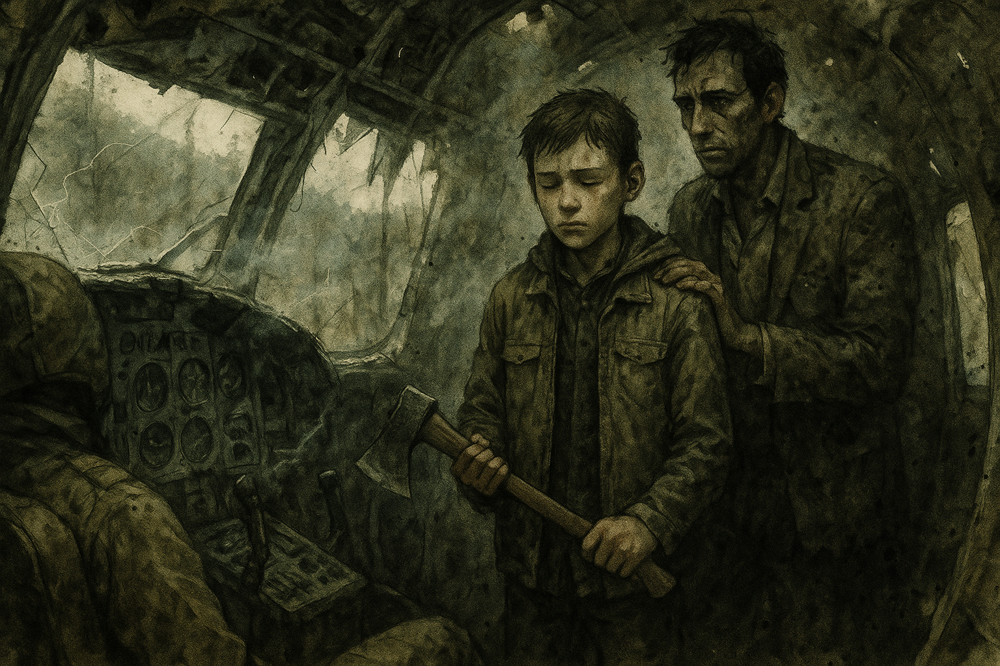

# Smoke on the Ridge

*Chapter 1 · 2026-09-07 · in-world 08/15/2030*

!!! warning "No recording"
    The audio for this session failed. This page is written from the GM's notes,
    so it narrates the table's beats rather than quoting them.

## Overview

An ordinary morning at [the Hollow](../wiki/locations/the-hollow.md) — knife
practice, canning, snares, a window to stare out of — ended when a sound nobody
in these mountains has heard in five years came out of the cloud bank: an engine,
in the air. A cargo plane clipped the ridgeline and went down within sight of the
smoke. The four survivors walked out to it and found a debris field, a dying
pilot, a shattered sample case bound for somewhere called **Station Ivy**, and
proof that somebody out there still has fuel, aircraft, and a schedule.

They also found that they were not the only ones who came for the smoke.

## Key Events

### The New Normal

Five years in, the days mostly get through themselves. Johnathan Banks was
teaching [Marcus Webb](../wiki/npcs/marcus-webb.md) knife fighting — self-defense
work, on a subject Banks himself knows almost nothing about. CJ was canning
vegetables with [Birdie Coyle](../wiki/npcs/birdie-coyle.md). Chuck was walking
his small snares for small game, and one large snare set for Bigfoot. Ash was
reading, and staring out a window.

Under all of it, the same conversation everyone at the Hollow keeps having in
pieces: **winter is coming and the root cellar is nearly bare.**

### The Sign

Then the engine. Everyone stopped at the same moment, because some part of them
recognized it before their brains caught up. It dropped out of the low grey
ceiling over the ridgeline — small, single-engine, a boxy cargo pod slung
underneath, faded purple and orange still readable under years of grime — and it
wasn't flying so much as fighting. The engine died. A long few seconds of wind.
Then the impact: not an explosion, just a heavy, final, wrong sound of metal
meeting mountain, and a few seconds later the smoke and the smaller second blast
of fuel catching.

Birdie read the smoke and put it at five to ten miles out.

### Who Goes

All four survivors went. Marcus begged to come and **Banks said no** — and CJ
overruled him: he's had to learn sometime, the days of babying are over. Banks
conceded on one condition, that Marcus was CJ's responsibility.

[Tucker Vance](../wiki/npcs/tucker-vance.md) stayed behind and made the only
request anyone made of them: bring back or at least catalogue any mechanical
salvage. An engine could become a water pump, or electricity. Anything else
becomes parts.

They took tarps, rope, a flashlight, and the rifle, and walked.

### The Crash Site

[The wreck](../wiki/locations/the-crash-site.md) was scattered across about a
hundred and fifty yards of timber, and the whole slope smelled strongly enough of
aviation fuel to taste it. They stopped at the edge of it before touching
anything.

- **Ash** found a dead passenger with a clipboard held tight against his chest —
  the one thing he'd decided to hold onto. Most of the paper had burned. What
  survived was a partial flight log: a 0640 departure, forty percent fuel at the
  waypoint, **relay strip 2 confirmed open** and topped off, **six passengers
  plus cargo IVY-4**, a 0915 departure heading east-southeast, deteriorating
  weather, and **Station Ivy expecting arrival by 1400 if the weather held**.
- **CJ** turned up a satellite radio with a dead battery.
- **Chuck** found the **IVY-4 case** itself — military grade, and destroyed. Vials
  broken, whatever samples they held contaminated or gone. He came away with one
  intact document of record, which he has not shown the others.
- **Banks** found the cockpit.

### The Pilot

One pilot was obviously dead, identified by nothing but a scorched name patch
reading **J. OKA**. The other was barely alive, with the look of someone who
knows exactly how long she has. She whispered three things:

> *"The samples… Don't radio, they are listening. Must reach Ivy."*

Banks asked where Ivy was. She got out *"East, near th—"* and died.

### The Hatchet

Then Banks brought Marcus into the cockpit and told him to take out his hatchet.

Marcus didn't understand at first. Then he did. Banks talked him through it — the
training from before, the fact that the dead have to be dealt with this way or
they come back — the way you talk someone through a thing you have already
decided they are going to do. Marcus raised the hatchet, closed his eyes, and
brought it down on the dead woman's head. Banks handled the other one.

They came out of the wreck with the boy blank-faced and the hatchet hanging
bloody at his side.

### Something in the Tree

While that was happening, CJ heard a walker hiss and could not find it, because
it wasn't on the ground. It was above her, working its way out along a limb —
**the climbing herd**, the first thing this table ever established about these
mountains, finally arriving in person. It dropped on her.

She rolled with it, got her hatchet out, blocked the bite on her forearm, split
its skull, rolled on top of it, hit it again, and took its head off.

### Slow Clapping

The party was regrouping when applause came out of the treeline.

Three men walked out armed. Two more came out behind them a moment later. The one
in front was looking at Banks, and he opened with a name nobody else there had
ever heard: **"Johnny Bank Notes."**

[Wade Tolliver](../wiki/npcs/wade-tolliver.md) — forties, weathered, quiet in a
way that does its own threatening — runs trade and outside relations for
[the Last Stop](../wiki/locations/the-last-stop.md). The unfinished Buc-ee's the
survivors looked at, wanted, and decided would kill them is inhabited, and has
been. **Fifty people.** Their leader is
[Emmet Castellan](../wiki/npcs/emmet-castellan.md): former special forces, smart,
dangerous, brilliant when he's lucid and self-medicating from the plaza's
pharmacy shelf when he isn't.

And Banks was offered a place with that crew once, before, and turned it down.

### The Split

Tolliver did honest math out loud: the party arrived first, so the initial
salvage is theirs. But he has sick people, and he asked for the bulk of any
medical supplies.

While the two groups talked, the searching continued. Marcus turned up a **solar
battery**. Ash found an empty cooler. Chuck — who has spent years getting very
good at finding things that aren't there — found a partially damaged semi-auto
rifle, a case of money, and **hospital-grade medical supplies**, and called
Tolliver's crew over to them.

### The Herd

Then the sound nobody wants to hear, from every direction at once. The noise and
the fuel and the blood had brought a herd in through the surrounding trees.

Two groups, one debris field, and walkers coming out of the timber. That's where
the session ended.

## Memorable Moments

- **A boy, a hatchet, and a man who wouldn't do it for him.** Banks refused to
  let Marcus come, lost that argument, and then chose to be the one who taught
  him what has to be done to the dead. The scene the whole table leaned into.
- **"Don't radio, they are listening."** Not *get help*. Not *tell someone*. A
  dying woman's last coherent instruction was to keep quiet, and nobody has any
  idea who she meant.
- **The climbing herd, collected.** Session zero's Unsetting Answer came due, out
  of a tree, onto the one survivor best equipped to deal with it — and CJ dealt
  with it alone, in silence, in three swings.
- **Chuck out-searches everybody.** The man with the Bigfoot snare found the
  rifle, the money, and the medicine. Years of looking for something that isn't
  there turn out to be excellent training.
- **"Johnny Bank Notes."** Five armed strangers walk out of the treeline and the
  first weapon anyone draws is a nickname.
- **King Buc-ee has a king.** The plaza Banks campaigned to rule in session zero
  is holding fifty people under somebody else — and Banks was invited in once and
  said no.
- **Ash's haul.** She found the single most important object of the session and
  an empty cooler.

## Open Threads

- **The herd is on top of them.** The session ended mid-encounter, with two
  groups, an unclaimed debris field, and walkers coming in from all sides.
- **Chuck's document.** He kept one record out of the IVY-4 case and hasn't shown
  it to anyone. Nobody else knows it exists.
- **Station Ivy is expecting an arrival that will never land.** East or southeast,
  on a schedule, reachable by radio — and it is 1400 somewhere.
- **"They are listening."** Somebody monitors the airwaves. The Hollow has a
  satellite radio now (dead battery) and the group has
  [the Watchman](../wiki/npcs/the-watchman.md) already broadcasting into their
  lives from somewhere out past the dial.
- **West.** The plane flew *out* of it, carrying a passenger *out*, not in. The
  place these mountains only tell as a fireside story just became a place with
  aircraft and avgas — and something worth fleeing.
- **J. Oka.** Four letters on a burned name patch. Nobody has said them to
  [Sister Ruth Okafor](../wiki/npcs/ruth-okafor.md) yet.
- **What Banks turned down.** Tolliver offered him a place with the Last Stop
  crew and he refused. He hasn't told the others why, or that it happened.
- **Fifty armed neighbors know where the Hollow's generosity starts.** The medical
  supplies bought goodwill. They also bought information.
- **What Marcus is now.** He asked to be taken seriously. He was.

## The Scene

The cockpit smelled like fuel and copper and something underneath both of those
that Marcus didn't have a word for yet. Banks went in first, folded himself
sideways through the gap where the door used to be, and Marcus followed because
nobody told him not to. Daylight came through the windscreen in long broken
pieces. There was a woman in the left-hand seat with her head back and her mouth
open, and she had been talking to Banks four minutes ago, and now she wasn't.
Marcus looked at the instrument panel instead. It was buckled in the middle like
something had leaned on it.

"Take out your hatchet," Banks said.

He said it the way he said everything — flat, unbothered, like he was reading a
number off a page. Marcus got it clear of his belt and held it in both hands and
waited to be told what it was for, and the waiting went on a beat too long, and
somewhere in that beat he understood, and his whole face changed. Banks saw it
happen and didn't look away from it. "You know what happens if we don't," he
said. "You've heard it your whole life. Everybody in that cabin has told you at
least once, and every one of them has done it, and not one of them has ever let
you in the room for it." He shifted, so he wasn't between the boy and the seat
anymore. "You asked to come. This is what's out here. This is the whole of it."

Marcus said, "She was alive." Banks said, "She was. That's why it has to be
now." The boy set his feet the way he'd been taught that morning, by a man
who didn't know the first thing about knives, and raised the hatchet, and closed his
eyes — which is the one part nobody would mention afterward — and brought it
down. It landed. It landed badly and then it landed properly, and Banks stepped
past him and dealt with the other one himself, unhurried, two strokes, the way
you'd close up a shop. Then he put a hand between the boy's shoulder blades and
steered him back out into the grey afternoon. Marcus came out of that wreck with
nothing on his face at all and the hatchet hanging down at the end of his arm,
wet, and CJ — who had just killed a thing that fell on her out of a tree, and
hadn't told anybody yet — looked up and saw him, and understood that she had won
the argument that morning.
