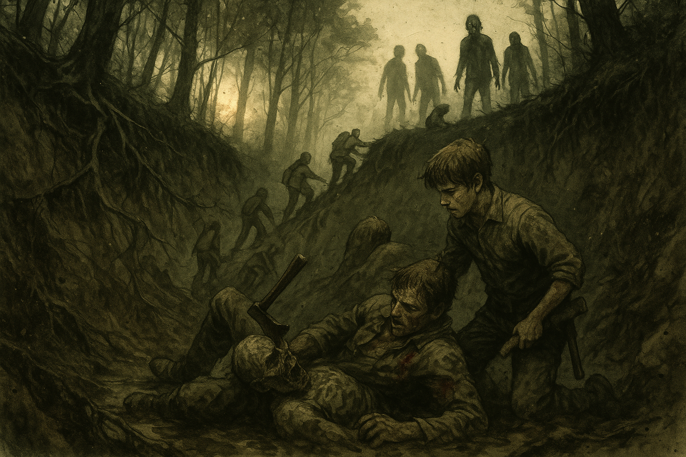

# The Half We Left Behind

*Chapter 2 · 2026-09-13 · in-world 08/16/2030*

## Overview

The herd closed on [the crash site](../wiki/locations/the-crash-site.md) at
golden hour. [Wade Tolliver](../wiki/npcs/wade-tolliver.md)'s crew took the
medical crate, lit firecrackers, and marched out in formation without looking
back. The survivors ran, slid into a mud ravine full of the dead, and climbed
out on tree roots. They walked home in the dark past
[the Old Yeller](../wiki/locations/the-old-yeller.md), bleeding but all alive,
[Marcus](../wiki/npcs/marcus-webb.md) included.

Back at [the Hollow](../wiki/locations/the-hollow.md), everything they had
carried off the mountain started talking. Chuck's hidden document said the plane
was moving walker blood and human test subjects. The salvaged battery had a
sealed sample box built into it. [Sister Ruth](../wiki/npcs/ruth-okafor.md)
looked at a pair of burned dog tags and said her niece's name. Ash got a radio
working, asked the air about Ivy, and [the Watchman](../wiki/npcs/the-watchman.md)
answered with a riddle. The riddle was a set of coordinates.

## Key Events

### Team's Team

The session opened right where the last one ended: sunlight slanting through the
trees, fifteen to twenty walkers coming out of the treeline from every side, and
two groups standing in the same debris field.

Tolliver's people moved the moment they saw them. A whistle, a snap, numbers
called out, *east egress*. Guns came up and firing lanes were covered. Two of
them lifted the hospital-grade medical case (bigger than a backpack, closer to a
footlocker full of instruments) and started walking it backward out of the
wreck, with Tolliver covering them. It looked like a military unit because it
was run like one.

It also meant the Last Stop crew was leaving, and taking the only fighting force
on the hill with them.

### A Plan Nobody Used

CJ had the first idea. The whole slope reeked of aviation fuel, heaviest around
the fuselage and the tail. They had matches. Pull the herd into the soaked
ground and set it on fire, and you save the ammo and take out a crowd.

Banks liked it, and said to get the kid first.

[Marcus](../wiki/npcs/marcus-webb.md) was standing by the cockpit where they'd
left him, with his hatchet still wet from the pilot. He hadn't moved. CJ went to
him and tried to talk him out of it, and he looked at her and said *"I just
killed somebody… and now zombies."* He wasn't going anywhere on his own, so she
picked him up and slung him over her shoulder.

Someone at the table also floated shooting one of Tolliver's crew in the leg so
the dead would slow down for him. The idea was noted, called the Otis maneuver,
and dropped.

The fire never got lit.

### Johnny Bank Notes Runs

Banks had told everyone, days ahead of time, exactly what he would do if things
went bad: run. He did. He yelled that they had the supplies and there was no
reason to stay, then booked it for the corner of the field. Once he got there he
turned around and covered the others with the rifle, which is more than anyone
expected.

Chuck and Ash were stranded at the back of the wreck, near the fuel. Chuck made
it across. Ash tripped.

### Ash

A walker hit Ash in the back while she was getting up and slammed her face-first
into the dirt. Her ears rang and her vision blurred, and the dead thing was on
top of her.

Graycen described what happened next as the first time anyone had seen real
emotion out of Ash. She scrambled out from under it, whipped around, and hacked
at it with the machete, screaming the whole time. When it stopped moving she
kicked the remains for good measure and ran off over the hill.

Across the field, Tolliver lit a string of firecrackers and threw it into the
back of the wreck. The pops pulled the walkers toward the noise, and his crew
slipped away east down the hillside, firing a few real shots on the way.

Banks shouted after him to cover Ash while she got up, and reminded him he owed
him. Tolliver didn't stop walking.

> *"Sorry, pal. Team's team."*

### Braveheart

Then Marcus came back to himself all at once. He fought his way out of CJ's
arms, took the hatchet in both hands, charged the nearest walker, and put it
down. Then he kept running toward Banks like a boy who thought he was in
*Braveheart*.

### The Ravine

The group finally came together and ran northwest down the slope. The second
push against the herd went badly: nobody rolled a success and everyone's stress
climbed. Then the hillside gave out.

Banks slid first, *"like Chris Farley in* Black Sheep*,"* and Marcus grabbed for
him and went too, and then everyone was going down into a muddy ravine. They
stood up at the bottom and looked up at the faces of the dead looking down at
them. Ash threw the cooler at one. That was the last anyone saw of the cooler.

Something had already been waiting in the mud. Half a walker, legs gone and
caked in muck, crawled up Banks' side and went for his face. He got his hatchet
up and split its head, and on the way through he cut his own shoulder. Ian put
it this way: *the zombie doesn't hurt me. The ax does.*

The herd above was smaller now. CJ spotted a break at the top of the ravine
behind them, and they hacked and hauled their way up it using old tree roots as
handholds. Marcus put his hatchet away and helped pull the wounded Banks out.
Behind them the dead poured into the ravine and got stuck, clawing over each
other in the mud.

Looking back, one of them had clear green eyes. It looked almost human, like
someone you'd have known before.

### The Half in the Tree

They made the treeline, got their breath back, and the forest went quiet again.
Then something fell out of a tree onto Chuck.

It was half a walker: one arm, one shoulder, and a spinal cord dangling where
the rest of it should have been. It bit at his clothes and his hair. He drove
his elbow into its face until it broke. His arm was wrecked for his trouble, but
he wasn't bitten. The walker attack table was one number away from several bites
in the back and death within hours.

That was when the table realized who had decided, back in session zero, that the
dead in these mountains **climb**. Whoever had answered with the school bus
made sure everyone knew it wasn't them.

### Home in the Dark

With two or three hours of walking left and the light going, they voted to push
on rather than camp. Chuck led by the stars and a flashlight and got them there.
A shape on the ridge came out of the moonlight, and it was
[the Old Yeller](../wiki/locations/the-old-yeller.md), the turn for home.

Coming up on the Hollow, Banks asked whether they had a signal to tell the cabin
it was them. They didn't. Then [Birdie](../wiki/npcs/birdie-coyle.md)'s voice
called out of the dark, *"Jonathan? CJ?"* Flashlights came on, and she saw the
blood. She bandaged Chuck, the worst hurt, from the cabin's first aid kit.

Everyone gathered at a small fire. [Tucker](../wiki/npcs/tucker-vance.md) passed
Banks the moonshine jug. Banks poured some on his shoulder, took a swig, and
admitted to one single tear. CJ said Marcus had earned a drink, and Banks agreed
and handed the jug to the boy. *It's a good burn, Marcus.* He drank it through
his teeth.

### The Boots and the Argument

Banks walked over to the group looking extremely pleased with himself and asked
who wore a size eight. He handed CJ a pair of military boots he'd pulled out of
the wreck. She told him they made up for his little turn-and-run.

He didn't apologize. He had told them exactly what he would do, he had done it,
and he had covered them while he did. *"I told you I wasn't gonna risk my neck
for the kid."* Ash backed him up: *"He did say he was gonna run at the first
sign of trouble."* CJ called them all a bunch of losers.

### Chuck's Document

Ash asked about the cooler. Chuck said he'd told her to leave it, and then took
out the document he'd kept from the IVY-4 case and finally explained why.

- **The cargo was walker blood.** The manifest listed what was in the coolers.
- **It had to be kept at −20°C**, which can't be done without power. Wherever it
  was going has electricity, freezers, and the people to run them.
- **It was headed to another site**, meaning Ivy. They were running tests on how
  the infection works.
- **The dog tags** were also Chuck's find. They're burned, and the only readable
  letters are **O-K-A**. Chuck took the dog tags to mean the pilot was military.

### The Box in the Battery

Marcus had carried the satellite radio and the solar battery back to
[Tucker](../wiki/npcs/tucker-vance.md), and Banks sat down to help. The battery
still held a charge, and with scavenged wire they got static out of the radio.
While they were moving the battery around, something slid inside the casing.

Banks told everyone to glove up, because he'd seen too many movies, and they
put on latex gloves from the first aid kit. Tucker took a screwdriver to the back
plate. Built in under the battery was a hidden compartment holding a black box
about the size of a VCR, with a warning label on it.

Banks set it down on the table very carefully and went to get Chuck.

Chuck laid the document next to the box and matched them up:

- The box holds a **control serum from an untreated pool, reference sample
  only**.
- In the document's list of subjects, **two had never been exposed to walkers,
  and both turned when they died.** The subjects weren't soldiers or volunteers.
  They were people gathered up from out here.
- The work mentions **"improved suppression"**, meaning suppression of the virus
  itself.
- The question the research seems to be asking, in Chuck's words: whether *"they
  can make somebody turn without ever laying a finger on them."*

It might be a cure program. Chuck isn't convinced. He wants the box plugged back
into the battery that was keeping it cold, or into a freezer, because a control
sample could be priceless to whoever is doing this research.

Banks' reaction was about units: *we're in Tennessee, so why is this in
Celsius?* From there the conversation spiraled into world governments, the
Illuminati, and whether they'd weaponized the virus through Bigfoot. Everyone
was ready for that last one, and it came anyway.

The group landed on one conclusion: **they need to find Ivy.** Ash said it best:
it's their only lead, even if Ivy isn't working on a cure.

### Jasmine

On the other side of the fire, CJ was drinking weak tea with Birdie and Ruth and
talking about taking Marcus out to find a couple of walkers for practice. Ruth
had heard about the name on the dog tags.

Her brother's daughter had been training to fly. Her name was [**Jasmine**](../wiki/npcs/jasmine-okafor.md). She
was nineteen when the world ended, working toward her private license and hoping
to fly commercial someday, maybe for United. She lived in Colorado. Ruth hadn't
heard from her since.

Ruth asked if they could go back to the crash site. CJ told her the truth:
the pilot was dead, *permanently* dead, and *"we took care of it so she didn't
come back."*

Ruth asked Chuck for the dog tags, rubbed at the burned metal with her thumb,
and read a **J** in front of the **O-K-A**. Banks described the woman in the
cockpit to her. *That could be Jasmine,* Ruth said. *It sounds like Jasmine.*

Two things don't fit. Jasmine was never military, and the plane was a
repurposed FedEx cargo plane, not an airliner. On the other hand, it was flying
west to east, and Colorado is west. Nobody pushed the point. Five years is long
enough for people to end up in jobs they never trained for.

### The Watchman Answers

Meanwhile, Ash had gotten one of the radios working on her own. Nobody else was
in the room. She put out a call asking whether *IVY* meant anything to anyone.

A few minutes later, [the Watchman](../wiki/npcs/the-watchman.md) answered. She
came out to the fire and told the others that the Watchman guy talks in riddles.
Then she read it to them:

> *Last time on this name. Everything out here runs backward. Once the sun's
> down, smoke goes back on the fire, deer walk their tracks in reverse, and so
> will I. Where the ridgelines give out and the water starts downhill — thirty
> and seven, two past it, no further. Where the sun finishes its work and doesn't
> come back up from that side — eighty, and four past it, and stop. Don't come
> looking for company. Don't say her name on this line again.*

The whole group worked at it. The sun finishes its work in the west, so the
second number is west longitude. The rest is directions dressed up as poetry.
Pulled apart, it comes out to **37.2° N, 80.4° W**, in the **New River Valley in
southwest Virginia**, near the West Virginia line. That's about a day's drive,
if nothing goes wrong. The riddle puts [Station Ivy](../wiki/locations/station-ivy.md)
there.

### The Plan

A day's drive needs a vehicle and fuel. CJ has the Jeep and there's one tank of
gas, and the four of them will fit (everyone else won't). The route they
sketched out:

1. **[The Last Stop](../wiki/locations/the-last-stop.md)** for gas and
   provisions. The medicine they handed over without a fight counts as goodwill.
   Not shooting Tolliver's people in the leg on arrival also counts, though maybe
   leave that out of the negotiation. They'd trade the Hollow's perishables,
   since nobody will be home to eat them, and Birdie's dried medicinal herbs or
   her skill as a tracker. Chuck offered one other thing Birdie could trade, and
   CJ shut it down fast.
2. **[The retirement home](../wiki/locations/the-retirement-home.md)**, "Walkers
   on Walkers," for a raid on the old folks' medicine cabinets ahead of winter:
   prescriptions, oxygen tanks, and pudding cups. Some of the residents don't even
   have their dentures in.
3. **Virginia.**

They slept at the cabin. Everyone's stress dropped to zero, and morning at the
Hollow smelled like Birdie and Ruth making eggs, mush, and the last of the
coffee.

## Memorable Moments

- **"Sorry, pal. Team's team."** Tolliver's crew showed a level of military
  discipline nobody at the Hollow can match, and used it to leave. Banks called
  in an old favor, and it turned out the favor wasn't owed.
- **Johnny Bank Notes, as advertised.** Banks said he'd run at the first sign of
  trouble, and he did. Then he covered them with the rifle, came home with a gift
  of boots, and made no apology. Ash, the one who nearly died, took his side.
- **Ash, screaming.** The most withdrawn person at the Hollow got slammed into the
  dirt and came up swinging the machete and screaming until the thing stopped
  moving. Then she kicked it.
- **Marcus goes Braveheart.** He went from frozen and slung over CJ's shoulder to
  charging a walker with his hatchet in two hands. Then he helped haul Banks out
  of the ravine.
- **The zombie didn't hurt him. The ax did.** Banks killed a mud-caked half
  walker at the bottom of a ravine and cut his own shoulder doing it.
- **"Why did we say they could climb?"** A walker fell out of a tree onto the
  scientist, and the table suddenly remembered who had voted for climbing zombies
  in session zero. The school bus was somebody else's answer, and they said so.
- **"We're in Tennessee. Why is this in Celsius?"** Banks, faced with evidence of
  human experiments, focused on the units.
- **A single tear and a good burn.** Moonshine poured on Banks' shoulder, and a
  swig handed to the boy who'd earned it.
- **Solving the Watchman.** Four players with a map, arguing about which way the
  sun goes down, pulled a location out of a madman's poem.

## Open Threads

- **Ash said the name on the radio.** The dying pilot's last clear instruction
  was *don't radio — they are listening*, and Ash broadcast a question about Ivy
  the same night. The Watchman heard it. Nobody knows who else did.
- **"Don't say her name on this line again."** The Watchman treats *Ivy* as a
  name, and as something dangerous to say out loud. He called it the *last time*.
  He also said *so will I*, which sounds like he's leaving or going quiet.
- **Station Ivy: 37.2° N, 80.4° W.** Southwest Virginia, about a day's drive. It
  has power to keep samples at −20°C, fuel to fly them in, and a schedule.
- **The black box.** A control serum, a *reference sample only*, sitting on a
  table at the Hollow with no power keeping it cold. Chuck wants it back on the
  battery or in a freezer. How long it lasts without either is unknown.
- **The research.** Two people who were never exposed turned when they died.
  "Improved suppression." Can somebody be made to turn without anyone touching
  them? Chuck isn't convinced anyone is looking for a cure.
- **Jasmine Okafor.** Ruth read a *J* in front of *OKA* and thinks it could be
  her niece. It could be. Jasmine was never military, so the dog tags are
  unexplained, and Ruth wants to go back to the crash site.
- **Tolliver walked away.** The Hollow gave up the medicine without a fight and
  got left to the herd for it. The next stop on the route is his front door, and
  the group is counting on the goodwill he just showed them the limits of.
- **The retirement home.** Banks' letter of introduction opens that door. Ruth
  left the people there to come to the Hollow, and the group is now planning to
  raid its medicine.
- **Who goes, and who stays.** The Jeep carries four. Nine people live at the
  Hollow, the root cellar is still nearly bare, and winter is still coming.
- **No return signal.** The Hollow has no way to know that people walking up the
  road at night are its own. Somebody said they need to have a meeting.
- **The green eyes.** One of the walkers in the ravine still looked almost human.
- **Dearly departed.** Gary offered extra experience for a monologue about
  someone who has died, or for a flashback scene the other players act out.
  Nobody has taken him up on it yet.

## The Scene

The hillside didn't give way so much as change its mind. One step Banks was
running, and the next the red clay under his good shoes turned to grease and he
was on his back, sliding, going *oh — oh, shit* in a voice he'd have fired a
junior analyst for using. Marcus grabbed his collar and went with him. Marcus
had CJ's sleeve, CJ had a fistful of Ash, and Chuck had nobody to grab and went
down anyway. The five of them came down the slope in a tangle of elbows, roots,
and one airborne cooler, and landed in mud as deep as a man's shins. For a
second it was almost funny. Then Banks wiped the muck out of his eyes and looked
up. The last of the golden hour was coming through the trees overhead, and every
bit of it was blocked by the dead. They lined the lip of the ravine, shoulder to
ruined shoulder, looking down. Not moving yet, just looking. One of them had
green eyes, clear green, the kind you'd have noticed across a bar. Ash threw the
cooler at it. It didn't blink.

The mud moved under Banks' hand. He thought it was a root until it closed on his
wrist. It came up out of the muck all at once, half of something, with no legs
and a trailing rope of whatever had kept it together. It pulled itself up his
side hand over hand like he was a ladder, and its face was a mask of wet clay
with a mouth working in the middle. Its teeth clicked an inch from his ear. He
had the hatchet. He didn't remember drawing it, and he didn't remember deciding
anything. He brought it down, and it went through the soft skull like a
spade through turf and kept going, into the meat of his own shoulder. The walker
stopped. Banks didn't, for a second: he just lay there in the cold mud with a
dead thing on his chest and his own blood running hot down his arm, thinking,
with great clarity, *the zombie didn't get me. The ax did.* Then the pain
arrived.

Above them the herd leaned out over the edge. The first body tipped and fell,
hit the mud, and started getting up. "There," CJ said. She was pointing at a
break in the ravine wall behind them, where old roots stuck out of the clay like
the rungs of a bad ladder. Ash was already climbing it. Chuck followed her,
cursing. Banks got as far as his knees and no further, until a hand hooked under
his good arm and hauled him up. It was Marcus. An hour ago the kid couldn't move
his own feet. Now the hatchet was tucked back in his belt, his jaw was set, and
his face was grey and steady. "Come on," the boy said, and Banks, who had told
everyone on this mountain he wouldn't risk his neck for the kid, let the kid pull
him out. Behind them the dead poured into the ravine and got stuck, clawing over
each other in the mud, and the green-eyed one watched them go the whole way up.
